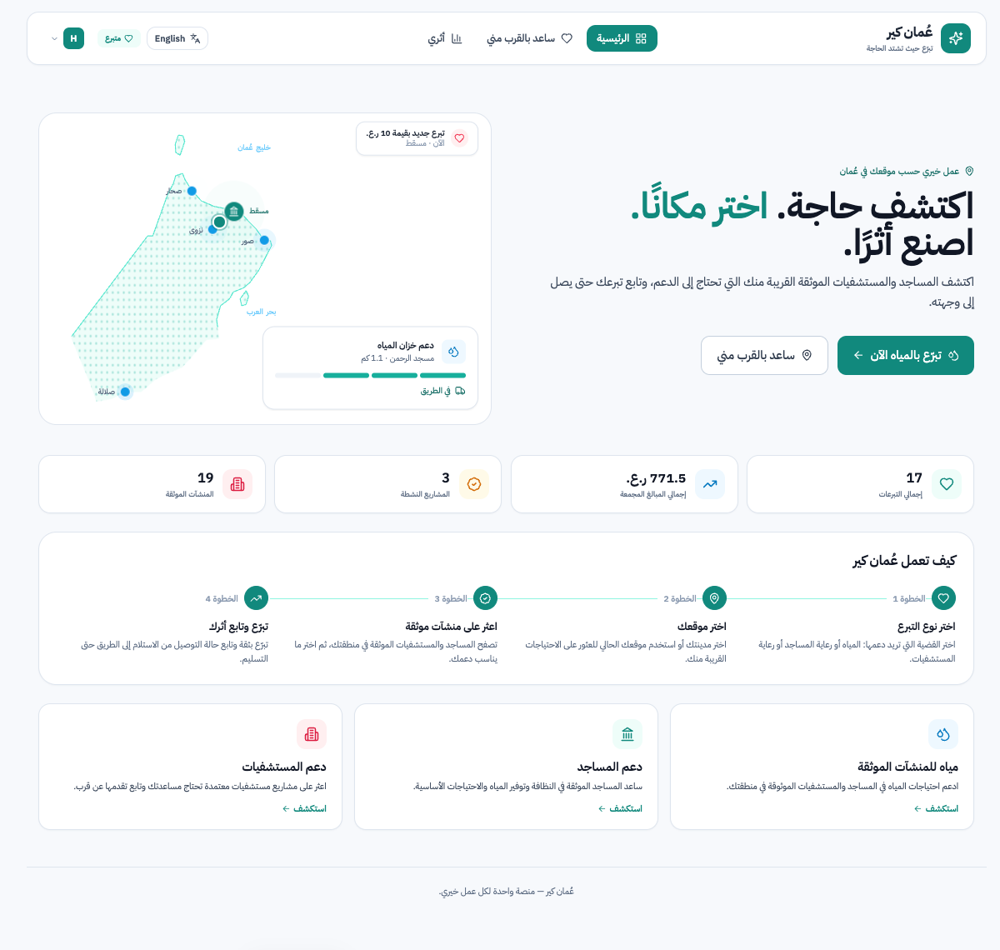

# OmanCare | عُمان كير

A location-aware donation platform for Oman. Donors find verified mosques and hospitals near them, donate to water needs, and track each donation until it is delivered.



## Features

- **Arabic first, with English.** The interface opens in Arabic (right-to-left) and has an English/العربية switch. Each browser remembers its choice.
- **Help Near Me.** Browse verified facilities by city, or share your location to see what is close to you on a list or a map.
- **Water donation flow.** Pick a city and a facility, choose an amount, and follow the delivery: received, preparing, on the way, delivered.
- **Service radius.** Each water post can serve a set area (for example 5 km). Donors using Near Me only see posts that reach them.
- **Admin panel.** Publish water posts with a photo, a description, a goal and a service radius. Close, reopen, edit or delete posts, verify facilities, and manage user roles.
- **My Impact.** Each donor sees their donations, receipt numbers and delivery status.

## Tech stack

- **Frontend:** React 18, TypeScript, Vite, Tailwind CSS, Leaflet (OpenStreetMap)
- **Backend:** FastAPI with SQLite (`backend/omancare.db`, created and seeded on first run)

## Run locally

Requirements: Node.js 18+ and Python 3.10+.

```bash
# 1. Install dependencies
npm install
pip install -r backend/requirements.txt

# 2. Start the API (http://localhost:8000)
npm run dev:backend

# 3. In a second terminal, start the web app (http://localhost:5173)
npm run dev:frontend
```

The web app forwards `/api/*` requests to the backend automatically. Uploaded post photos are saved in `backend/uploads/`.

## Demo accounts

| Role | Username / email | Password |
|---|---|---|
| Admin | `admin` (or `admin@omancare.com`) | `adminpass` |
| Donor | `donor@omancare.com` | `donor123` |

> **Demo only.** Logins are checked in the browser, so these passwords are visible to anyone, and the admin API does not check who is calling it. Add server-side authentication before using this with real donors.

## Project structure

```
src/
  components/   UI pieces (donation forms, maps, admin post form)
  views/        Pages: Home, Help Near Me, My Impact, Admin Panel
  lib/          API client, translations (i18n.ts), helpers
backend/
  app/main.py   FastAPI app, database schema, seed data, admin routes
docs/
  screenshots/  Images used in this README
```

## Known limitations

- The Organization dashboard still uses an older Supabase connection and shows no data.
- Project titles and descriptions appear in the language they were written in.
